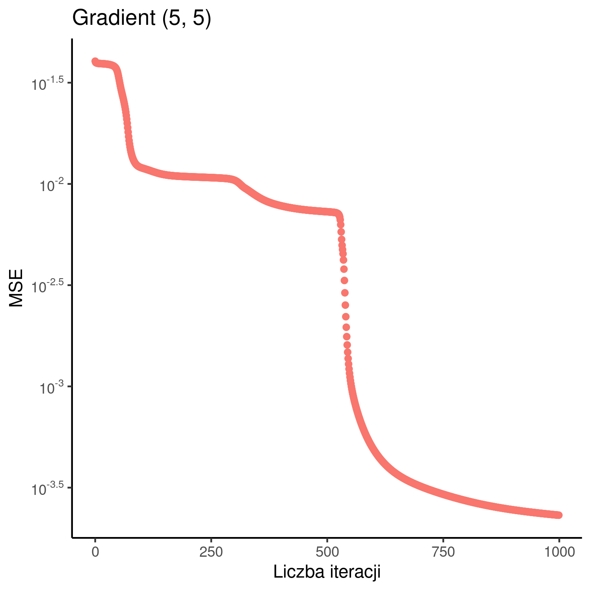
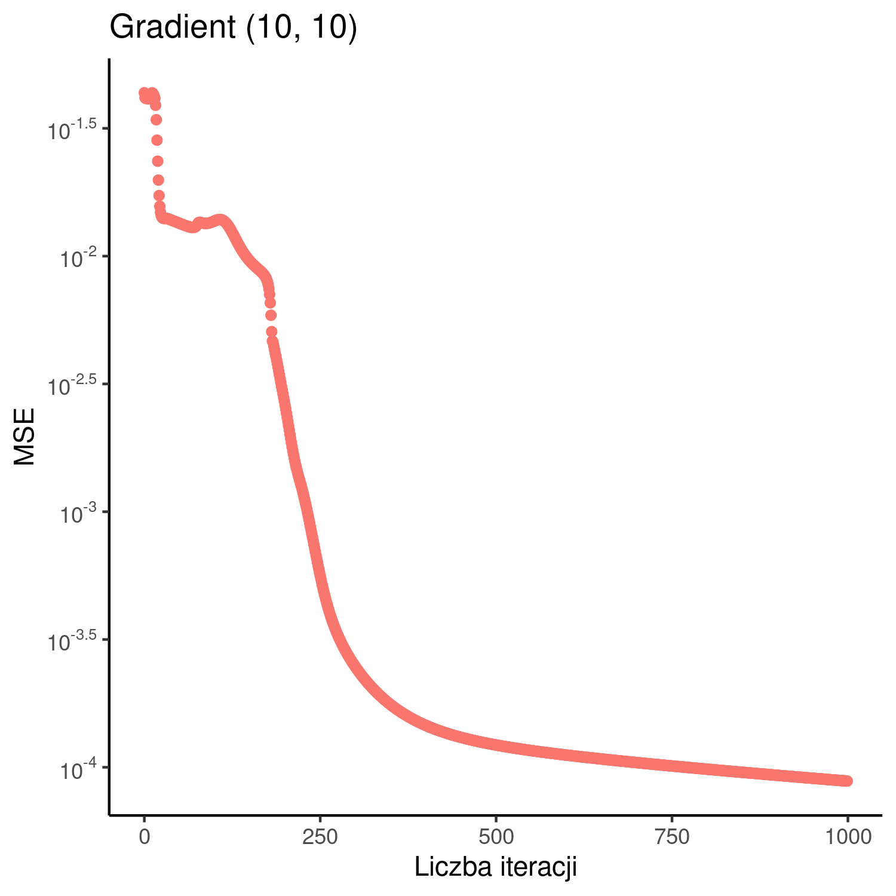
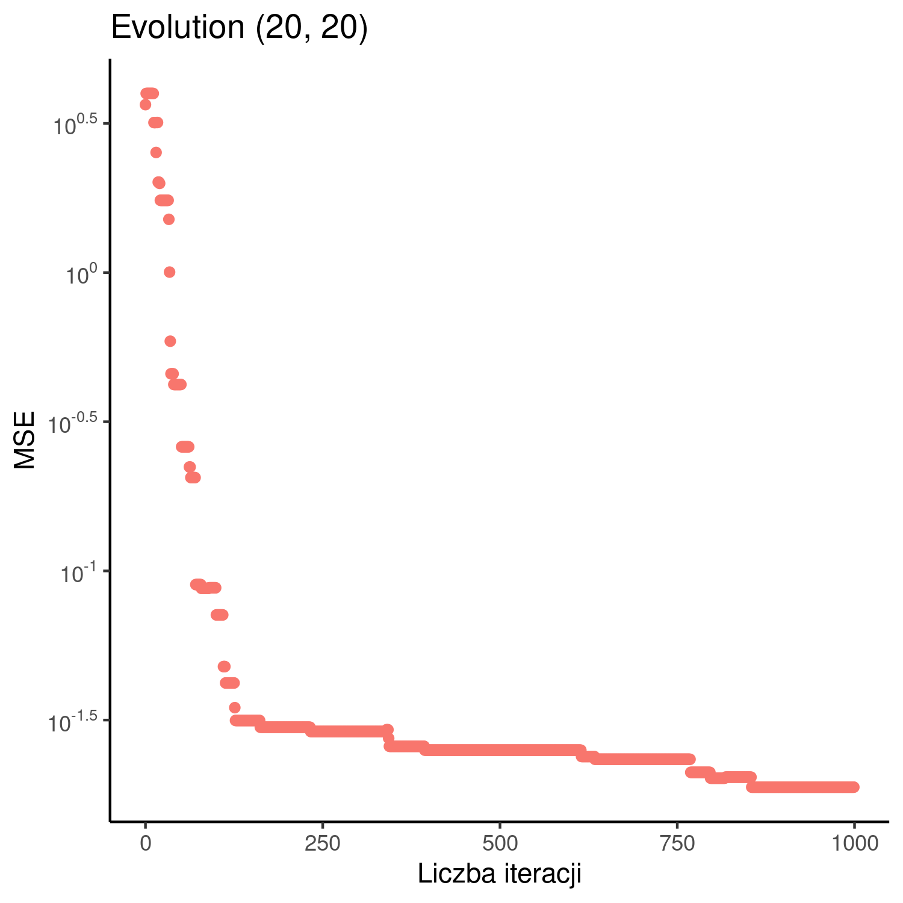
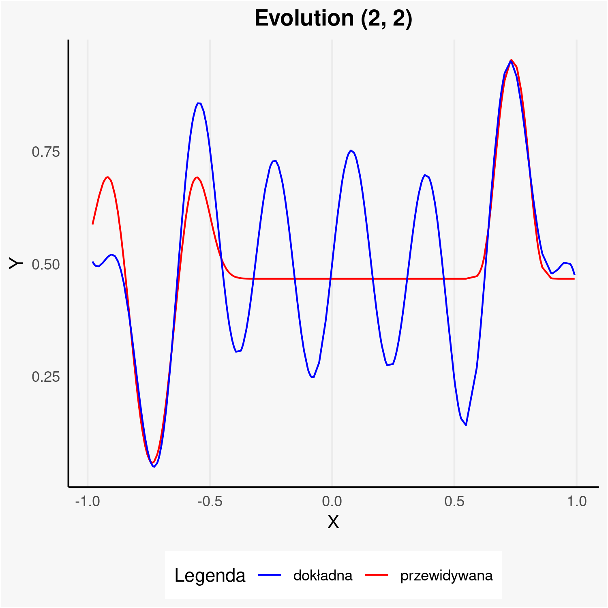
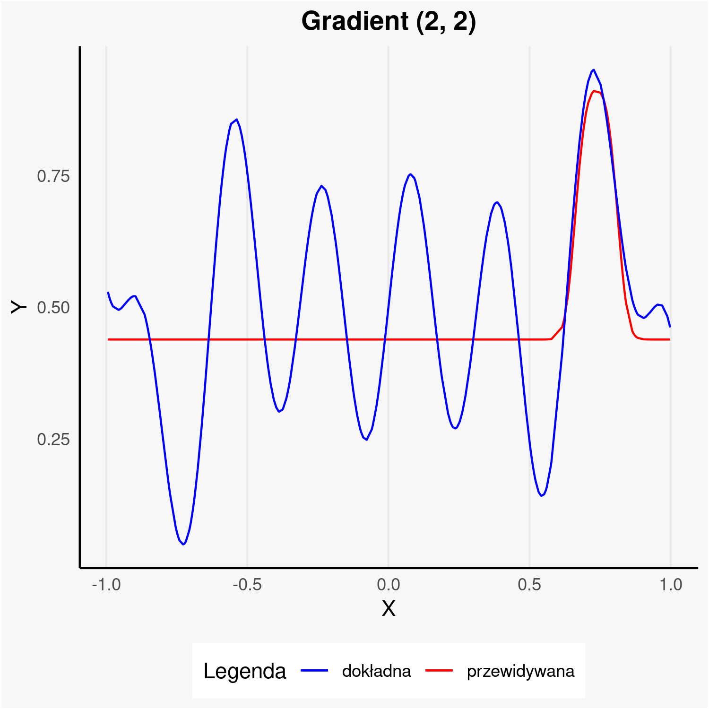
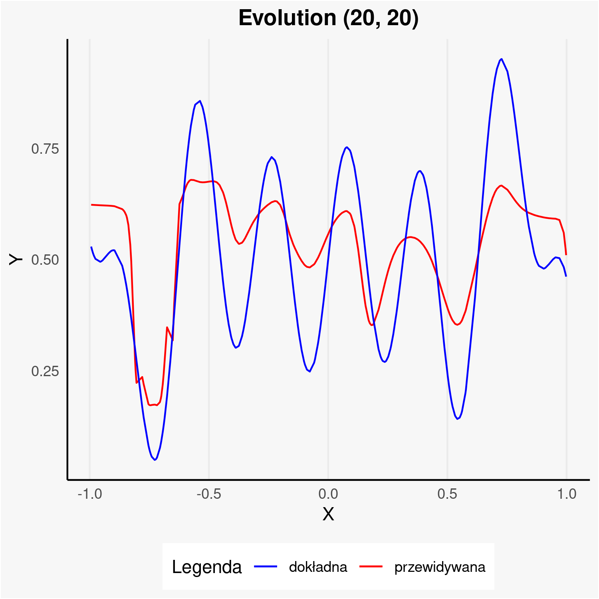
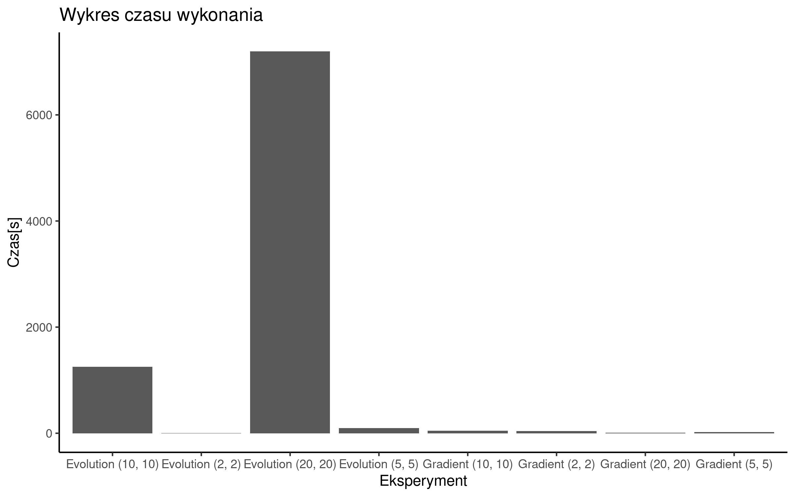

# [WSI] Kajetan Rożej/Mikołaj Szawerda - Zadanie 5. (Sieci Neuronowe)
## 1. Implementowane algorytmy

Głównym celem zadania 5. była
 implementacja perceptronu wielowarstwowego (ang. MLP
). Jest to najpopularniejszy typ sztucznych sieci neuronowych. Sieć tego typu składa się zwykle z jednej warstwy wejściowej, kilku warstw ukrytych oraz jednej warstwy wyjściowej. Neurony warstw ukrytych posiadają wiele wejść i jedno wyjście, a jego wartość obliczana jest w następujący sposób:

1. $s=\sum^n_{i=1} x_{j,i}^{k} w_{j,i}^{k} + b_{j}^{k}$, gdzie $(j, k)$ oznacza j. neuron w k. warstwie
2. $s=f(s)$ , gdzie s to wybrana funkcja aktywacji

W naszej sieci jako funkcję aktywacji zdecydowaliśmy się przyjąć gaussian ($f(x)=exp(-x^2)$), ze względu na dobre właściwości przy zastosowaniu sieci neuronowej jako aproksymatora uniwersalnego.

Trenowanie sieci polega na poszukiwaniu takiego zestawu wag i biasów, które pozwolą na jak najlepszą estymację zadanej funkcji. W tym celu wykorzystywać można metodę propagacji wstecznej, która to rozkłada uzyskany błąd na poszczególne neurony, wskazując kierunek, w którym w danej iteracji należy zmodyfikować wagi w celu zmniejszenia popełnionego błędu. Tempo modyfikacji wag określone jest natomiast za pomocą współczynnika uczenia.
Wykorzystanie tej metody w połączeniu z algorytmem gradientowym jest jednym z najpopularniejszych sposobów na znajdowanie wag sieci.

W związku z wymaganiami zaimplementowaliśmy również poszukiwanie wag przy pomocy algorytmu ewolucyjnego. Po konsultacji z prowadzącym, aby upodobnić sposób ten do metody gradientowej i skrócić czas wykonania zdecydowaliśmy się na wykorzystanie populacji liczącej jednego osobnika.

## 2. Zaplanowane eksperymenty

Do eksperymentów użyliśmy perceptronu z dwiema warstwami ukrytymi. Głównym zadaniem było zbadanie wpływu ilości neuronów w poszczególnych warstwach i użytego algorytmu (gradientowego lub ewolucyjnego) na przebieg procesu uczenia i jakość estymacji zadanej funkcji:

$f(x)=x^2sin(x)+100\space sin(x)cos(x)$

Po wstępnym rozpoznaniu zdecydowaliśmy się na następujące ilości neuronów:

- $2, 2$
- $5, 4$
- $10, 10$

plapala

Aby uzyskać pełniejszy obraz jakości poszczególnych rozwiązań, zmierzyliśmy również czas potrzebny na wytrenowanie poszczególnych wariantów sieci.

Do trenowania użyliśmy zbioru ...
Natomiast zbiór testowy stanowiło ...

W przypadku algorytmu ewolucyjnego ewaluacja rozwiązania przeprowadzana była dla całego batcha (XXX wartości), natomiast na potrzeby algorytmu gradientowego epoch został podzielony na N batcyh po M wartości, po których następowała aktualizacja wag. Liczbę iteracji ustalono na poziomie 3000 dla algorytmu ewolucyjnego i YYY dla algorytmu gradientowego.
Aby uzyskać miarodajne wyniki związane z wykorzystaniem losowości do inicjalizacji wektora wag (metoda gradientowa), jak i ogólnym działaniem algorytmu (metoda ewolucyjna), każdy eksperyment został uruchomiony kilka razy a do analizy użyto najlepszą z uzyskanych prób.

W celu poprawy własności optymalizacyjnych funkcji celu, przeskalowaliśmy $x$ i $f(x)$ do $\left \langle -1, 1 \right \rangle \times \left \langle 0, 1 \right \rangle$

## 3. Uzyskane rezultaty

### Wykres wartości MSE w poszczegolnych przypadkach:

Można zauważyć równomierny spadek MSE w przypadku użycia algorytmu ewolucyjnego. Algorytm z użyciem gradientu poradził sobie znacząco gorzej.

MSE dla algorytmu ewolucyjnego spadało bardziej równomiernie, niż dla algorytmu z użyciem gradientu. W tym przypadku gradient osiągnął rezultaty lepsze o rząd wielkości.

Algorytm gradientu w tym przypadku szybko znalazł otoczenie minimum i osiągnął rezultaty lepsze o rząd wielkości.

W przypadku wielu wymiarów algorytm ewolucyjny nie był w stanie wyjść z płaskowyżu nie poprawiał swojego rezultatu w kolejnych iteracjach. Algorytm z użyciem gradientu osiągnał rezulaty lepsze o dwa rzędy wielkości.

### Wykres porównujacy jakość estymacji w porównaniu z funkcją wejściową:

Oba algorytmy nie były w stanie dopasować się do kształtu funkcji - ilość wymiarów była niewystarczająca.

W przypadku warstw (5, 5) każdy z algorytmów przyjął kształt zbliżony do funkcji celu - algorytm z gradientem zrobił to lepiej

Dla warstw (10, 10) algorytm gradientu osiągnął niemalże idealne dopasowanie

Oba algorytmy poradziły sobie gorzej dla większej ilości neuronów - ewolucyjny w szczególności - pojawiło się zjawisko zwiększonej wymiarowości zadania

Porównując rezultaty pomiędzy ilością neuronów w warstwie, można zauważyć zjawisko nasycenia, gdzie niewystarczająca ilość neuronów prowadzi do wolnego zmniejszania funkcji celu, natomiast zbyt duża ilość znacząco zwiększa wymiarowość zadania, przez co algorytmy są podatne na pozostanie w niezadowalających optimach lokalnych.

### Wykres porównujący czas wykonania poszczególnych warintów:

Algorytmy sieci neuronowej z użyciem algorytmu ewolucyjnego wykonywały się o rzędzy wielkości dłużej od z użyciem gradientu. Jest to spowodowane koniecznością reprezentacji sieci neuronowej w postaci wektora(w celu skorzystania z solvera) i jej późniejszym transformacjom do postaci macierzowej

## 4. Wnioski

Tu będzie trzeba coś mądrego napisać. Spodziewane przeze mnie wnioski, które nie muszą się pokryć i lepiej się nimi nie sugerować (ok)

- wiekszą liczba neuronów to lepsza aproksymacja
- może coś nt. tego czy ma znaczenie która wartstwa jest bardziej znacząca (jeśli to wyjdzie)
- algorytm ewolucyjny działa dlużej niż gradientowy
- algorytm gradientowy daje lepsze wyniki niż ewolucyjny
- gradientowy stale i sukcesywnie zmniejsza MSE, a ewoluycjny wykonuje 'skoki' i czasami utyka.

